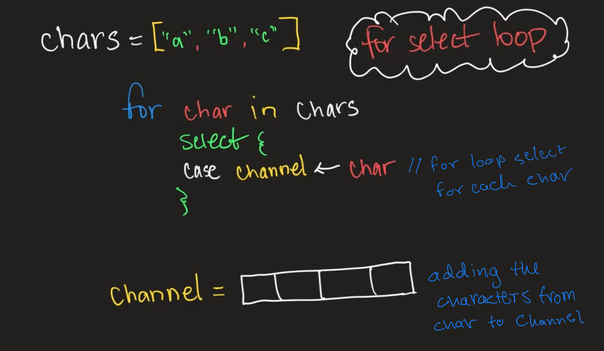

# For Select Loop Example

- A buffer acts as a queue where you can send the buffer length of data and it is treated as a queue
  - does not worry about being blocked by the recieving go routine
  - asynchronous
- An unbuffered channel makes the go routine wait for a response from the reciever before it allows the sender to send data
  - aka synchronous
- 